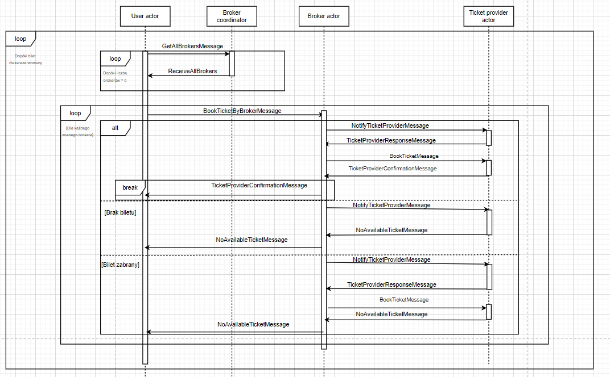

# Dokumentacja końcowa

## 1. Część formalna

### 1.1 Przedmiot

Systemy Wieloagentowe - SAG 2020L

### 1.2 Temat projektu

Wieloagentowy system rezerwacji biletów.

### 1.3 Zespół

- Tomasz Główka
- Maciej Radwan
- Krzysztof Potępa

### 1.4 Prowadzący projekt

Dr inż. Kamil Żbikowski

## 2. Opis problemu

Głównym celem projektu jest zbudowanie środowiska wieloagentowego modelującego system rezerwacji a następnie symulacja działania tego systemu oraz przetestowanie go w różnych scenariuszach.

## 3. Rozwiązanie

### 3.1 Wykorzystane narzędzia

Do realizacji proejktu zostały użyte następujące narzędzia i technologie:

- .NET Core - framework umożliwiający tworzyć i uruchamiać wysoce wydajne aplikacje na platformach Windows, Linux i macOS
- Akka.NET - zbiór bibliotek open-source umożliwiający tworzenie skalowalnych i odpornych systemów wykorzystujących model aktora
- Serilog - biblioteka do rejestrowania logów dla aplikacji .NET
- Seq - serwer do gromadzenia logów systemowych
- Docker - narzędzie służące do konteneryzacji aplikacji
- Docker Compose - narzędzie, które pozwala na definiowanie systemów składających się z wielu kontenerów

### 3.2 Architektura rozwiązania


Aplikacja składa się z dwóch głównych komponentów fizycznie podzielonych na dockerowe kontenery. Kontenery zostały złączone w jedną działającą całość za pomocą programu Docker Compose.

### 3.3 System rezerwacji biletów

#### 3.3.1 Architekur systemu

Głównym komponentem całego rozwiązania jest jak i głównym celem projektu jest wieloagentowy system rezerwacji biletów. Został on zaimplementowany przy użyciu frameworku .NET Core. Głównym atutem platformy .NET Core jest jej wieloplatformowość. Implementacja środowiska wieloagentowego w ramach systemu została wykonana za pomocą zbioru bibliotek Akka.NET

Poniższy schemat przedstawia hierarchie aktorów w systemie.


W obrębie sytemu możemy wyodrębnić następujących aktorów:

- Supervisor - aktor, który stoi na samej górze w hierarchii, zarządza koordynatorami
- User coordinator - aktor koordynujący pracę użytkowników
- Boker coordinator - aktor koordynujący pracę brokerów
- Ticket provider coordinator - aktor koordynujący pracę dostawców biletów
- User actor - komunikuje się z brokerami w sprawie rezerwacji biletu
- Broker actor - przyjmuje zgloszenia o rezerwacjach biletów i komunikuje się z dostawcami w sprawie rezerwacji
- Ticket provider actor - komunikuje sie z brokerami w sprawie rezerwacji/dostępności biletów

#### 3.3.2 Komunikacja pomiędzy aktorami

Aktorzy systemowi do komunikacji między sobą wykorzystują odpowiednio zdefiniowane wiadomości. Każdy aktor ma ściśle określoną listę typów wiadomości, które wie w jaki sposób ma obsłużyć. Wiadomości są przechowywane w skrzynkach pocztowych aktorów. Wiadomości są przetwarzane jedna po drugiej w takiej samej kolejności w jakiej zostały dostarczone do aktora. 

W prezentowanym rozwiązaniu kluczowe są następujące założenia:
-  Broker actor pyta o bilet tylko jednego losowo wybranego dostawcę spośród znanych mu dostawców i jeśli rezerwacja z losowo wybranym dostawcą się nie powiedzie to odsyła do user actora wiadomość o porażce
-  Broker actor dopóki nie zna żadnego dostawcy nie zacznie przyjmować wiadomości o chęci rezerwacji biletu
-  Koordynator dostawców (ticket provider coordinator) w momencie pojawienia się nowego dostawcy informuje każdego brokera o jego istnieniu
-  Dostawcy biletów w przypadku braku danego biletu i otrzymaniu wiadomości o chęci jego rezerwacji, po przekazaniu negatywnej odpowiedzi do brokera o dostępności biletu, dodają go do swojej puli

Brokerzy są głównym medium komunikacyjnym w procesie rezerwacji biletów. Pierwszą rzeczą, którą robi broker po stworzeniu jest komunikacja z koordynatorem dostawców (ticker provider coordinator) w celu uzyskania listy dostępnych dostawców. Poniższy schemat przedstawia komunikacje pomiędzy brokerem a koordynatoerm dostawców w celu do otrzymania takiej listy.


Gdy broker wie o tym, że jest dostępny przynajmniej jeden dostawca biletów proces rezerwacji może się rozpocząć.
Poniższy schemat przedstawia komunikacje pomiędzy aktorami w procecsie rezerwacji biletu. 




Poniższa tabela opisuje reakcje koordynatorów na poszególne typy wiadomości:

|                             | Rodzaj odebranej wiadomość   | Zachowanie                                                           |
| --------------------------- | ---------------------------- | -------------------------------------------------------------------- |
| User coordinator            | AddActorMessage              | Tworzy nowego aktora potomka                                         |
|                             | AddRandomCountActorMessage   | Tworzy losową ilość potomnych aktorów (stworzone do celów testowych) |
|                             | LogChildernCountMessage      | Loguje aktualną ilość potomnych aktorów                              |
|                             |                              |                                                                      |
| Broker coordinator          | AddActorMessage              | Tworzy nowego aktora potomka                                         |
|                             | AddRandomCountActorMessage   | Tworzy losową ilość potomnych aktorów (stworzone do celów testowych) |
|                             | LogChildernCountMessage      | Loguje aktualną ilość potomnych aktorów                              |
|                             | GetAllBrokersMessage         | Odsyła aktualną listę brokerów                                       |
|                             |                              |                                                                      |
| Ticket provider coordinator | AddActorMessage              | Tworzy nowego aktora potomka                                         |
|                             | AddRandomCountActorMessage   | Tworzy losową ilość potomnych aktorów (stworzone do celów testowych) |
|                             | LogChildernCountMessage      | Loguje aktualną ilość potomnych aktorów                              |
|                             | GetAllTicketProvidersMessage | Odsyła aktualną listę dostawców biletów                              |


Koordynatorzy nie zmieniają swojego stanu w trakcie działania systemu. Oznacza to, że niezależnie od momentu otrzymania wiadomości reakcja na nie jest zawsze taka sama. Niektórzy aktorzy potomni koordynatorów (User actor, Borker actor) zmieniają swój stan w zależności od miejsca, w którynm się znajdują przez co reakcja na otrzymywane wiadomości może się zmieniać w zależności od stanu.

Reakcje na wiadomości aktorów potomnych koordynatorów:

|                       | Rodzaj odebranej wiadomość/Stan aktora                          | Zachowanie                                                                                                                                               |
| --------------------- | --------------------------------------------------------------- | -------------------------------------------------------------------------------------------------------------------------------------------------------- |
| User actor            | ReceiveTimeout/LookingForBrokersState                           | Ponowne wysłanie wiadomości do koordynatora brokerów z prośbą o przysłanie aktualnie dostępnych brokerów                                                 |
|                       | ReceiveAllBrokers/LookingForBrokersState                        | Otrzymanie aktualnych brokerów i przejście w stan BookingTicketState                                                                                     |
|                       | TicketProviderConfirmationMessage/BookingTicketState            | Otrzymanie potwierdzenia o rezerwacji biletu, zatrzymanie aktora                                                                                         |
|                       | NoAvailableTicketMessage/BookingTicketState                     | Jeśli żaden ze znanych brokerów nie zarezerwował biletu, przejście w stan LookingForBrokersState. Jeśli został jakiś niepytany broker, spytaj go o bilet |
|                       |                                                                 |                                                                                                                                                          |
| Broker actor          | ReceiveAllTicketProvidersMessage/WaitingForTicketProvidersState | Otrzymanie dostępnych dostawców biletów i przejście w stan WaitingForUserActorState                                                                      |
|                       | BookTicketByBrokerMessage/WaitingForTicketProvidersState        | Odłożenie wiadomości w celu późniejszego przetworzenia                                                                                                   |
|                       | ReceiveAllTicketProvidersMessage/WaitingForUserActorState       | Otrzymanie dostępnych dostawców biletów i odświeżenie aktualnie posiadanej listy dostawców                                                               |
|                       | BookTicketByBrokerMessage/WaitingForUserActorState              | Wysłanie do losowo wybranego dostawcy zapytania o dostępność biletu                                                                                      |
|                       | NoAvailableTicketMessage/WaitingForUserActorState               | Otrzymanie wiadomości o braku dostępności biletu. Przekazanie jej dalej do odpowiedniego User actora                                                     |
|                       | TicketProviderResponseMessage/WaitingForUserActorState          | Otrzymanie wiadomości o dostępności biletu. Wysłanie prośby o rezerwacje                                                                                 |
|                       | TicketProviderConfirmationMessage/WaitingForUserActorState      | Otrzymanie potwierdzenia o rezerwacji biletu. Przekazanie jej dalej do odpowiedniego User actora                                                         |
|                       |                                                                 |                                                                                                                                                          |
| Ticket provider actor | NotifyTicketProvidersMessage/WaitingForBrokerState              | Sprawdzenie i wysłanie informacji o dostępności biletu                                                                                                   |
|                       | BookTicketMessage/WaitingForBrokerState                         | Jeśli bilet wciąż dostępny to rezerwacja i pozytywna odpowiedź. Jeśli bilet w międzyczasie został zarezerwowany to odesłanie negatywnej odpowiedzi.      |
|                       | LogBookedTicketCountMessage/WaitingForBrokerState               | Zalogowanie aktualnej ilości zarezerwowanych biletów                                                                                                     |

#### 3.3.3 Hierarchia aktorów

System został zbudowany w oparciu o strukturę hierarchiczną posiadającą trzy poziomy. Pierwszy i najwyższy zawiera jednego aktora (Supervisor). Kolejna niższa warstwa została wydzielona dla tzw. koordynatorów. Wszyscy koordynatorzy są dziećmi Supervisora. Na trzecią i ostatnią warstwę hierarchii składają sią dzieci koordynatorów. Dzięki takiej strukturze wykorzystane zostały mechanizmy nadzorowania aktorów oferowane przez Akka .NET. Biblioteka oferuje do wyboru dwie strategie nadzorowania:
- One-For-One - w przypadku błędu zgłoszonego przez potomka rodzic decyduje co zrobić tylko z tym, który zgłosił błąd
- All-For-One - w przypadku błędu zgłoszonego przez potomka decyzja rodzica, poza zgłaszającym wyjątek, jest również przenoszona na reszte potomstwa

Poza strategiami nadzorowania Akk.NET pozwala również zdecydować jaka powinna być reakcja rodzica w przypadku zgłoszonego błędu przez jednego z potomków. Tu mamy do wyboru:
- Resume
- Restart
- Stop
- Escalate
  
Spośród powyższych zaimplementowane zostały strategia One-For-One oraz w przypadku błędu zgłoszonego przez potomka na reakcja rodzica została wybrana dyrektywa Resume. 

#### 3.3.4 Logowanie zdarzeń

Do monitorowania zdarzeń w sytemie został użyty pakiet Akka.Logger.Serilog. Niezależnie od wyboru narzędzia do logowania Akka .NET oferuje do tego ujednolicone API. Za pomocą biblioteki Serilog logi finalnie trafiają do serwera Seq. Pozwala on na wykonywanie zapytań na zgromadzonych logach oraz ich wizualizację. Dzięki tej konfiguracji (Akka -> Serilog -> Seq) dużo łatwiej monitorować poszczególne zdarzenia w systemie oraz ocenić poprawność zaimplementowanego rozwiązania.

Logowane są następujące zdarzenia:
 - tworzenie aktorów najniższej warstwy hierarchii
 - otrzymanie jakiejkolwiek wiadomości
 - wysłanie jakiejkolwiek wiadomości
 - zarezerwowanie biletu przez dostawcę
 - otrzymanie potwierdzenia rezerwacji przez user actora
 - zgłoszenie błędu
 - zgłoszenie ilości zarezerwowanych biletów przez dostawcę
 - zgłoszenie ilości potomków koordynatorów (czyli ile dany koordynator ma potomnych aktorów)

Poniżej przedstawiony przykładowy zrzut ekranu ze zwizualizowanymi danymi z serwera Seq:


## 4. Testy

### 4.1 Konfiguracja
W celu przeprowadzenia testów i sprawdzenia poprawności zaimplementowanego rozwiązania system należy uruchomić podając na start nazwę pliku zawierającego parametry środowiska, w którym system ma być przetestowany.

Przykładowy plik konfiguracyjny wygląda następująco:
```
{
  "InitialActorCount": {
    "UserActor": 100,
    "BrokerActor": 1,
    "TicketProviderActor": 5
  },

  "NewActorMessageInterval": {
    "UserActor": 5,
    "BrokerActor": 0,
    "TicketProviderActor": 0
  },

  "NewActorCount": {
    "UserActor": {
      "MinCount": 1,
      "MaxCount": 10
    },
    "BrokerActor": {
      "MinCount": 1,
      "MaxCount": 1
    },
    "TicketProviderActor": {
      "MinCount": 1,
      "MaxCount": 1
    }
  },

  "RandomExceptionMessageInterval": {
    "UserCoordinatorActor": 0,
    "BrokerCoordinatorActor": 0,
    "TicketProviderCoordinatorActor": 0,
    "UserActor": 0,
    "BrokerActor": 0,
    "TicketProviderActor": 0
  },

  "RandomExceptionMessageProbability": {
    "UserCoordinatorActor": 20,
    "BrokerCoordinatorActor": 20,
    "TicketProviderCoordinatorActor": 20,
    "UserActor": 20,
    "BrokerActor": 20,
    "TicketProviderActor": 20
  },

  "SystemDelays": {
    "Coordinators": {
      "MinCount": 5000,
      "MaxCount": 1
    },
    "CoordinatorsProbability": 0,
    "CoordinatorsChildren": {
      "MinCount": 5000,
      "MaxCount": 5000
    },
    "CoordinatorsChildrenProbability": 0
  },

  "InitiazlSingleRouteTicketsCount": 1,

  "DeepLogging": true
}
```

Zgodnie z powyższym plik posiada następujące sekcje:
- InitialActorCount - określa ile aktorów ma być stworzonych podczas startu systemu
- NewActorMessageInterval - określa co ile sekund ma zostać wysłana wiadomość do koordynatorów o stworzenie nowej liczby potomków
- NewActorCount - określa przedział z którego jest losowana liczba aktorów do stworzenia
- RandomExceptionMessageInterval - określa co ile sekund ma zostać wysłana wiadomość wywołująca losowy błąd u wybranego aktora
- RandomExceptionMessageProbability - określa z jakim prawdopodobieństwem wiadomość wywoła błąd u aktora
- SystemDelays:
  - Coordinators - określa (w milisekundach) przedzial z którego losowana jest liczba oznaczająca o ile zostanie opóźnione przetwarzanie wiadomości u wszystkich koordynatorów
  - CoordinatorsChildren - to samo co wyżej tylko u wszystkich potomków koordynatorów
  - CoordinatorsProbability - określa prawdopodobieństwo wystąpienia opóźnienia u koordynatorów
  - CoordinatorsChildrenProbability - to samo co wyżej tylko u potomków koordynatorów
- InitiazlSingleRouteTicketsCount - określa ilość biletów na każdą z możliwych tras początkowo oferowanych przez dostawców
- DeepLogging - flaga informująca o ilości logowanych zdarzeń. Ustawiona na true loguje wszystkie zdarzenia opisane w sekcji *3.3.4 Logowanie* zdarzeń. Ustawiona na false wyłącza logowanie pierwszych czterech spośród wymienionych w sekcji *3.3.4 Logowanie zdarzeń*.

### 4.2 Uruchomienie

W celu uruchomienia systemu wraz z odpowiednim scenariuszem (plikiem) należy użyć następujących poleceń:

W pierwszej konsoli:
```
sudo docker-compose up --build
```

W przeglądarce pod adresem localhost:80 powinnien odpowiedzieć serwer Seq.
Przed uruchomieniem systemu nalezy wgrać do serwera Seq odpowiednie pliki z przygotowanymi dashoboardami do wizualizacji danych. Są to pliki w formacie JSON znajdujące się w katalogu **Seq\dashboards** (niestety na tą chwile serwer Seq nie pozawala na zautomatyzowanie tego procesu i trzeba to ręcznie przekopiować). 


W drugiej konsoli:
```
sudo docker exec -it sag_system /bin/bash
```

Po wejściu do kontenera należy użyć polecenia:
```
dotnet SAG.dll
```
a nstępnie podać nazwę pliku ze scenariuszem.

W celu zakończenia pracy systemu w drugiej konsoli wystarczy wcisnąć dowolny klawisz. Przed uruchomieniem kolejnych scenariusz należy usunąć aktualnie zgromadzone logi z serwera. Aby to zrobić należy przekierować się do settings -> RETENTION -> MANUALLY DELETE EVENTS -> Delete matching events:


### 4.3 Przeprowadzone testy

#### 4.3.1 Testy komunikacji
Do przeprowadzenia podstawowego testu wymiany wiadomości pomiędzy aktorami trzeciej warstwy użyty został plik **komunikacja.json**. Charakteryzuje się on stworzeniem tylko jednego user actora, jednego brokera i jednego ticket providera. Żeby podejrzeć w jaki sposób zostały wymienione wiadomości należy w zakładce events wykonać zapytania znajdujące się w katalogu *Seq\queries*. Widać, jak odbywa sie proces rezerwacji biletu oraz to, że aktorzy wymieniają wiadomości w sposób opisany wcześniej

#### 4.3.2 Testy obciążeniowe 
Do przeprowadzenia testów obciążeniowych użyty został plik **obciazeniowe.json**. Charakteryzuje się on dużą początkową liczbą user actorów chcących rezerwować bilet oraz zwiększaniem w 10 sekundowym interwale tej liczby o tysiąc. Również opcja *DeepLogging* została ustawiona na false ze względu na zbyt duża liczbę generowanych logów (tylko dashboard *General* będzie pokazywał dane przez wyłączoną opcję *DeepLogging*). Widać, że pomimo dużej liczby przetwarzanych wiadomości system w krótkim czasie (kilkunastu sekund) pokonał falę rezerwacji. 

#### 4.3.3  Testy losowych błędów
Do przeprowadzenia testów z losowymi błędami użyty został plik **bledy.json**. Charakteryzuje się on wysyłaniem wiadomości generujących losowy błąd w interwałach 10 sekundowych do wszystkich aktorów. Ponadto prawdopodobieństwo rzucenia błędu zostało ustawione na 20% oraz *DeepLogging* został ustawiony na true. Widać, że pomimo generowanych błędów (tabela *Exceptions* na dashboardzie *Overview*) system zachowuje się w sposób poprawny.

#### 4.3.4 Testy opóźnienia
Do przeprowadzenia testów z opóźnieniem użyty został plik **opoznienie.json**. Charakteryzuje się on opóźnianiem każdej przetwarzanej wiadomości przez aktorów najniższej warstwy o 5 sekund. Widać, że system działa z zadanym opóźnieniem. Bilety są bardzo wolono rezerwowane.

### 4.4 Własne testy
W celu przeprowadzenia testów za pomocą własnego scenariusza należy skomponowany plik konfiguracyjny umieścić w folderze *MultiAgentBookingSystem (.net core)\SAG\SystemTest\TestInputFiles*. Następnie należy  powtórzyć opisane kroki w sekcji *4.2 Uruchomienie*.

## 5. Linki

- https://getakka.net/articles/intro/what-is-akka.html
- https://serilog.net/
- https://datalust.co/seq
- https://www.docker.com/
